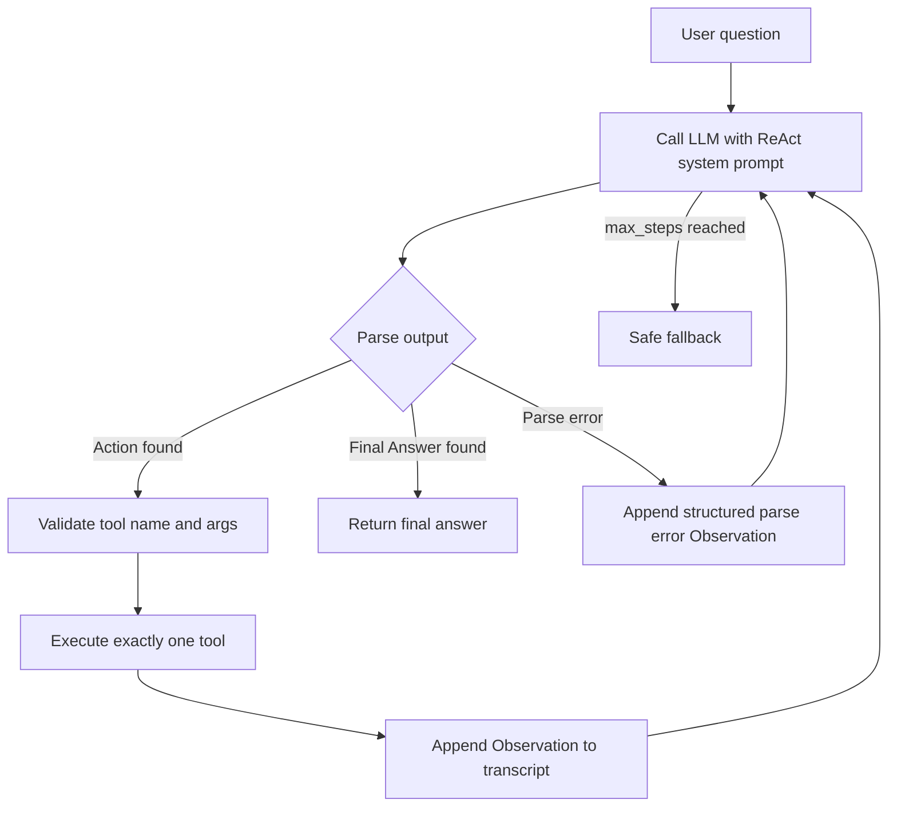

```mermaid
flowchart TD
    A[User question] --> B[Call LLM with ReAct system prompt]
    B --> C{Parse output}
    C -->|Action found| D[Validate tool name and args]
    D --> E[Execute exactly one tool]
    E --> F[Append Observation to transcript]
    F --> B
    C -->|Final Answer found| G[Return final answer]
    C -->|Parse error| H[Append structured parse error Observation]
    H --> B
    B -->|max_steps reached| I[Safe fallback]
```
